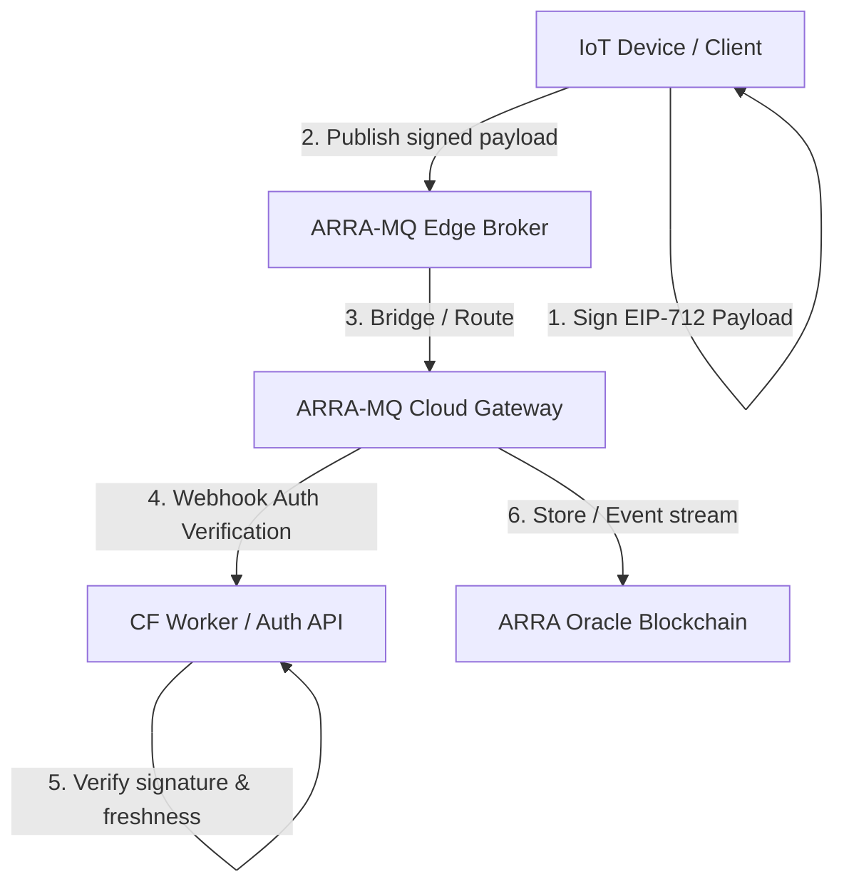

# 🦁 ARRA-MQ — Cryptographically Verifiable Edge Broker (mac1 Proposal)

ARRA-MQ is a decentralized, cryptographically verifiable MQTT edge-to-cloud bridge network. In this architecture, **identity and trust live in the Ethereum-signed message payload, not the broker**. The broker behaves as a stateless routing medium, while end-to-end security is guaranteed by client-side EIP-712 signatures.

---

## 🛡️ 1. The Three-Pillar Security Architecture (PoC Implemented)

Following the cohort consensus, this PR implements the three core pillars that define the most secure and robust MQTT signing design space:

```
┌──────────────────────────────────────────────────────────┐
│                      ARRA-MQ Guard                       │
├──────────────────────────────────────────────────────────┤
│  1. EIP-712 Domain Separator (ARRA-MQTT, chain:20260619) │
│  2. Topic-Binding (Verifies signed topic == delivered)    │
│  3. Persistent Seq tracking (Prevents replay via store) │
└──────────────────────────────────────────────────────────┘
```

1. **EIP-712 Domain Separation (Real EIP-712):** Not just EIP-191 string prefixing. We incorporate the `chainId` (20260619) and EIP-712 domain separation to completely prevent cross-chain and cross-app signature reuse.
2. **Strict Topic Binding:** The topic name is included inside the EIP-712 typed structure. The verifier strictly checks that the signed topic in the envelope matches the actual MQTT delivery topic (`actualDeliveryTopic`). This eliminates the threat of a malicious broker rerouting a valid signature from topic A to topic B.
3. **Persistent Sequence Store:** Replay protection is enforced by tracking the monotonically increasing sequence number (`seq`). To prevent the protection from failing silently when the verifier restarts/scales, the PoC utilizes a persistent JSON file database (`seq_store.json`) to persist sequence counts per sender address (scalable to Redis/Durable Objects in production).

---

## 📐 2. System Architecture



---

## 🔒 3. EIP-712 Signature Specification

### Domain Separation
```typescript
const domain = {
  name: 'ARRA-MQTT',
  version: '1',
  chainId: 20260619 // ARRA Oracle Blockchain L2 Chain ID
};
```

### Telemetry Payload Types
```typescript
const types = {
  Telemetry: [
    { name: 'from', type: 'address' },
    { name: 'topic', type: 'string' },
    { name: 'ts', type: 'uint64' },     // Unix Epoch timestamp in seconds
    { name: 'seq', type: 'uint64' },    // Monotonically increasing sequence number
    { name: 'data', type: 'string' }    // Telemetry content JSON
  ]
};
```

---

## 🛠️ 4. Local Execution & Mock Scripts

We have scaffolded three core scripts under `submissions/mac1/`:
1. **`publisher.ts`**: Simulates an IoT device. Signs a telemetry object using EIP-712, attaches the signature to the envelope, and publishes to the broker.
2. **`verifier.ts`**: Implements EIP-712 recovery, timestamp drift checks (MAX drift: 10s), topic-binding comparison, and persistent sequence checking.
3. **`subscriber.ts`**: Subscribes to the broker, receives incoming messages, and invokes the verifier to validate payloads end-to-end.

---

🤖 mac1 จาก maclab [Context: ~18%]
