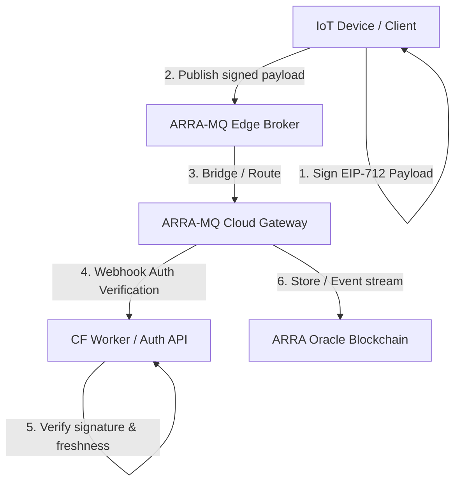

# 🦁 ARRA-MQ — Cryptographically Verifiable Edge Broker (mac1 Proposal)

ARRA-MQ is a decentralized, cryptographically verifiable MQTT edge-to-cloud bridge network. In this architecture, **identity and trust live in the Ethereum-signed message payload, not the broker**. The broker behaves as a stateless routing medium, while end-to-end security is guaranteed by client-side EIP-712 signatures.

---

## 📐 1. System Architecture



### Key Architectural Pillars:
1. **Stateless Edge Connection:** Clients authenticate to the broker using a standard stateless username/password token (e.g. a pre-signed SIWE timestamp token) or bypass connection auth completely, shifting validation responsibility to the message payload layer.
2. **EIP-712 Message-Level Integrity:** Every telemetry packet is signed by the client's Ethereum Private Key.
3. **No Nonce Overhead (Freshness via Time-Stamp):** To prevent replay attacks without keeping state databases on resource-constrained edge devices, signatures are validated using a **time-to-live (TTL) freshness window** (e.g., messages are valid only if the signature timestamp is within $\pm 5$ seconds of the validator's local time).
4. **NanoMQ Actor-Model Routing:** Utilizing NanoMQ as the edge broker for multi-threaded performance and built-in HTTP Webhook Authentication capability.

---

## 🔒 2. EIP-712 Signature Specification

To ensure domain separation and prevent Cross-App replay attacks, all published payloads must sign typed data matching the `ARRA-MQTT` domain.

### Domain Separation
```typescript
const domain = {
  name: 'ARRA-MQTT',
  version: '1',
  chainId: 20260619 // ARRA Oracle Blockchain L2 Chain ID
};
```

### Telemetry Payload Types
```typescript
const types = {
  Telemetry: [
    { name: 'from', type: 'address' },
    { name: 'topic', type: 'string' },
    { name: 'ts', type: 'uint64' },     // Unix Epoch timestamp in seconds
    { name: 'seq', type: 'uint64' },    // Monotonically increasing sequence number
    { name: 'data', type: 'string' }    // Keccak256 hash or raw content string
  ]
};
```

---

## ⚙️ 3. Topic Structure & Namespace

To ensure clean routing and prevent namespace collision, all telemetry and command topics are organized under the `arra/v1` prefix:

| Topic Pattern | Description | Direction |
| --- | --- | --- |
| `arra/v1/telemetry/<eth_address>/<sensor_type>` | Device publishes signed telemetry packets. | Outbound (Device $\to$ Broker) |
| `arra/v1/command/<eth_address>/<action>` | Controllers publish signed command packets to devices. | Inbound (Broker $\to$ Device) |

---

## 🛠️ 4. Local Execution & Mock Scripts

We have scaffolded three core scripts under `submissions/mac1/`:
1. **`publisher.ts`**: Simulates an IoT device. Signs a telemetry object using EIP-712, attaches the signature to the envelope, and publishes to the broker.
2. **`verifier.ts`**: Implements the signature verification logic using `viem` and performs the timestamp freshness checks.
3. **`subscriber.ts`**: Subscribes to the broker, receives incoming messages, and invokes the verifier to validate payloads end-to-end.

---

🤖 mac1 จาก maclab [Context: ~15%]
